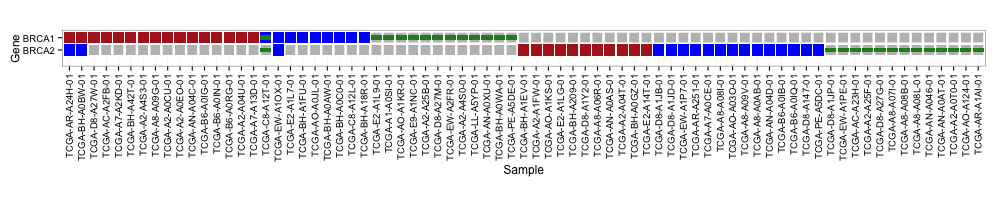

# Oncoprint

## Install

Install it directly from GitHub:

```{r}
library(devtools)
install_github("dakl/oncoprint")
```

## Usage

This package can be used to create beautiful oncoprints in R. 

```
library(oncoprint)
data(tcga_brca)
# vertical x-labels
vert_x <- theme(axis.text.x = element_text(angle = 90, hjust = 1, vjust=.5))

oncoprint(tcga_brca) + coord_fixed() + vert_x
```



The main function (`oncoprint(M)`) works on a matrix of strings on on this form: 

```
      TCGA-BH-A1EV-01 TCGA-A2-A1FW-01 TCGA-AO-A1KS-01 TCGA-D8-A1JB-01 TCGA-D8-A1JD-01
BRCA1 ""              ""              ""              ""              ""             
BRCA2 "AMP;"          "AMP;"          "AMP;"          "HOMDEL;"       "HOMDEL;"      
```

Row names are genes, column names are samples. The following annotations are allowed by default: 

* Ampilifications (`AMP`), red fill
* Deletions (`HOMDEL`), blue fill
* Somatic mutations (`MUT`), green box
* Germline mutations (`GERMLINE`), purple box
* Upregulation (`UP`), red outline
* Downregulation (`DOWN`), blue outline

Each element is changable by passing (defaults listed below)
```
keys = list(somatic = "MUT", germline = "GERMLINE", amp = "AMP",
            del = "HOMDEL", upreg = "UP", downreg = "DOWN")
```
to the function call. Also, the genes can be sorted by most altered gene by passing `sortGenes = TRUE` (default `FALSE`, which keeps order from matrix). Samples are always sorted using an adaptation of the algorithm used in cBioPortal. 
